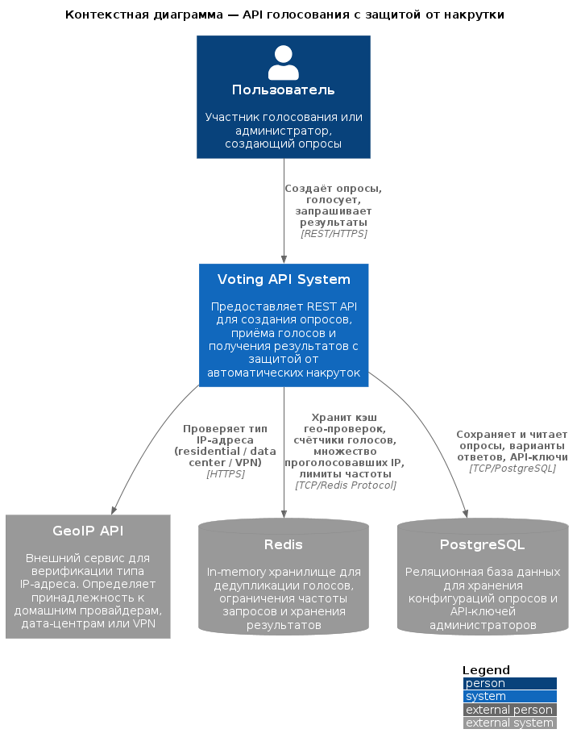
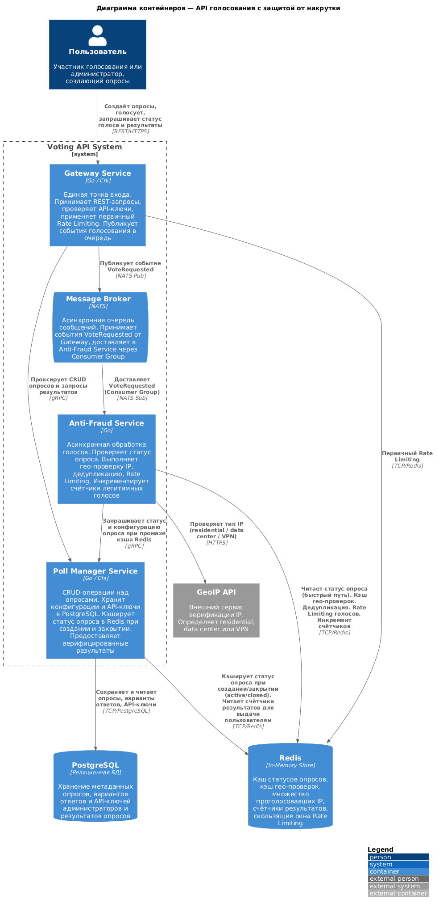
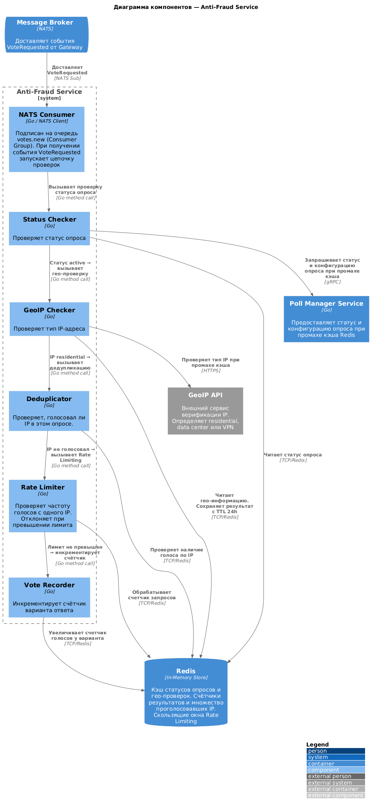

# Система голосований с защитой от накруток

## Problem Statement

Пользователи онлайн-платформ нуждаются в простом API для создания и проведения голосований, а администраторы — в защите от автоматических накруток. Система предоставляет REST API для создания опросов, приема голосов с привязкой к IP-адресу и проверкой его принадлежности к residential-провайдерам, блокируя трафик из дата-центров и VPN. Сервис взаимодействует с Redis для исключения дублирующихся голосов, ограничения частоты запросов и хранения результатов, а также с внешним GeoIP API для верификации типа IP-адреса.

---

## Диаграмма C4 Model

### 1. Context Diagram (Контекстная диаграмма)

**Файл:** [practice1/context.puml](practice1/context.puml)

**Диаграмма:**

### 2. Container Diagram (Диаграмма контейнеров)

**Файл:** [practice1/container.puml](practice1/container.puml)

**Диаграмма:**

### 3. Component Diagram (Диаграмма компонентов)

**Файл:** [practice1/component.puml](practice1/component.puml)

**Диаграмма:**

## Итоги

### Таблица анализа

| Аспект | Что сгенерировал ИИ | Что исправлено вручную | Обоснование исправления |
|--------|-------------------|----------------------|----------------------|
| Структура системы | Сами микросервисы, их роль, взаимодействие друг с другом | Проанализированы представленные варианты и из них составлен итоговый | ИИ изначально предлагал чуть более сложную систему, чем нужно. Не все связи были им продуманы. |
| Контекстная диаграмма | Основная структура, микросервисы | Описание микросервисов | ИИ подразумевал более сложную логику работы сервиса в целом |
| Диаграмма контейнеров | Полную диаграмму со всеми связями | Названия связей, наличие связей, описание микросервисов | ИИ слишком избыточно описывает контейнеры и связи между ними, забывая про некоторые связи |
| Диаграмма компонентов (Ani-Fraud) | Полная диаграмма | Название связей | Названия были излишне избыточны |

### Вывод

В случае проектирования данного сервиса искользовалась большая языковая модель DeepSeek. С его помощью была, во-первых, определена структура и логика работы сервиса. Во-вторых, рассмотрено множество вариантов реализации и определены наиболее оптимальные. В-третьих, на основе продуманной структуры реализованы три уровня диаграмм, посредством генерации кода PlantUML.

Сгенерированный код требовал незначительной ручной доработки, исправления генераций, посредством последующих промптов.

Данная языковая модель хорошо справилась с этой задачей и корректно исправила выявленные недочеты. Откуда можно сделать вывод, что использование DeepSeek полезно при проектировании архитектуры информационной системы.
---